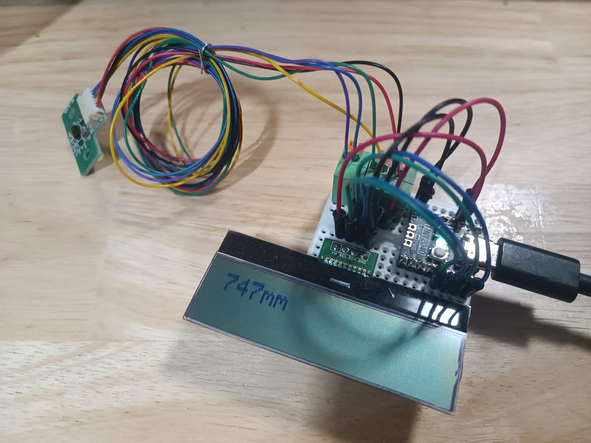

# rpi-pico-tof

A test program for the STM VL53L1X ToF ranging sensor that works on RP2040 microcontroller written in MicroPython.

## Components

- RP2040
  - Example module: [Pimoroni Tiny 2040](https://shop.pimoroni.com/products/tiny-2040)
- VL53L1X
  - Example module: [AE-VL54L1X](https://akizukidenshi.com/catalog/g/gM-14249/))
  - Based program: [drakxtwo/vl53l1x_pico](https://github.com/drakxtwo/vl53l1x_pico) (MIT License)
- AQM1602A
  - Example module: [AE-AQM1602A(KIT)](https://akizukidenshi.com/catalog/g/gK-08896/)

## License

[MIT license](LICENSE)

## Author

[mikan](https://github.com/mikman)
